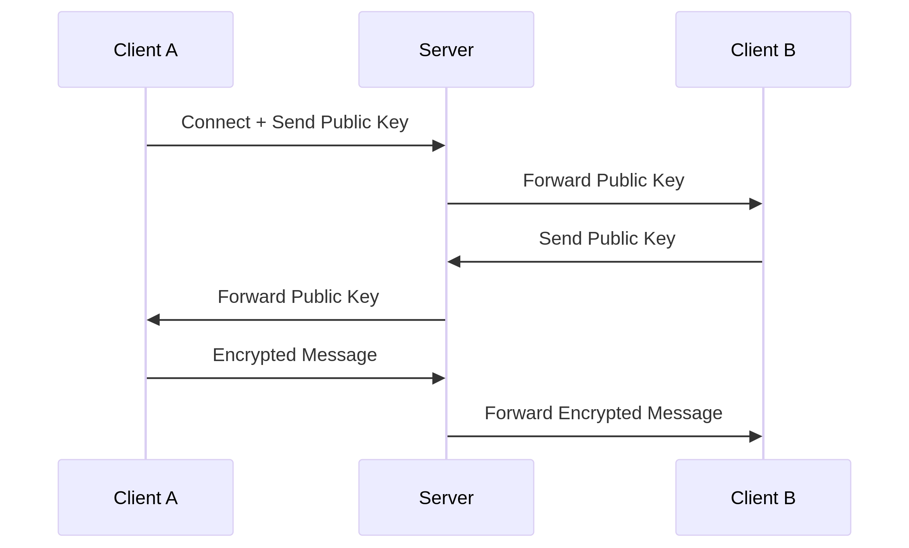

# Xtty - Secure Terminal Chat

 _Example chat session_

Xtty is an end-to-end encrypted terminal chat application with:

- **No serverside message storage**
- **Ephemeral session keys** (new keys for each chat)
- **Room-based authentication** (share a code to connect)
- **Lightweight TUI interface**

## 🚀 Quick Start (For Users)

### Prerequisites

- Go 1.20+
- Terminal with 256-color support

### Installation

`git clone https://github.com/yourusername/xtty.git`
`cd xtty`

Start the server
`go run ./cmd/xtty/main.go`

User A create chat room
`go run ./cmd/xtty-client/main.go -username Alice`

User B join the chat room
`go run ./cmd/xtty-client/main.go -username Bob -join 7B3X9P`

Start chatting

### **Diagrams Explanation**

**Sequence Diagram**: Shows the secure message flow between users via the server


**Component Table**: Breaks down the technical building blocks

## Key Components

    1. Room Code - 6-digit temporary session identifier
    2. RSA-2048 - Key exchange & message encryption
    3. WebSocket - Persistent connection channel
    4. TUI - Terminal User Interface

## **Directory Tree**: Visualizes the code organization

```

xtty/
├── cmd/
│ ├── xtty/ # Server main
│ └── xtty-client/ # Client main
├── internal/
│ ├── client/ # Client logic
│ ├── server/ # Server logic
│ └── common/ # Shared types
└── go.mod # Dependencies

```

### Key Sections:

1. **For Users**:

   - Simple copy-paste commands
   - Clear visual flow
   - No technical jargon

2. **For Developers**:

   - Architecture overview
   - Precise file locations
   - Suggested improvements
   - Standardized dev setup

3. **Visual Aids**:
   - Mermaid diagrams render on GitHub/GitLab
   - Clean tables for technical specs
   - Clear directory structure

This README provides:

- Immediate usability for beginners
- Technical depth for contributors
- Clear visual explanations
- Maintainable structure
